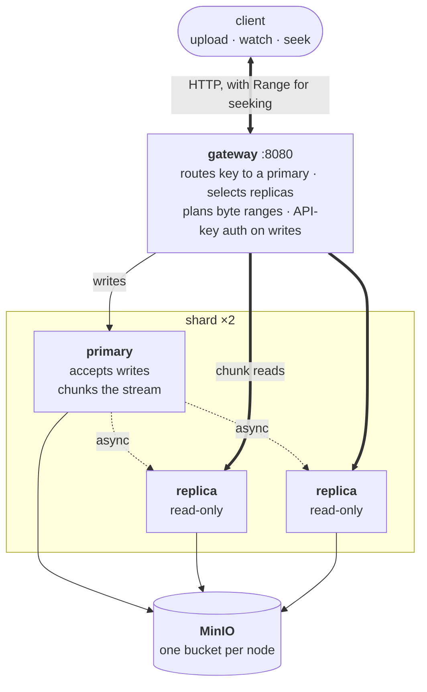

# Heimdall

A video-streaming load balancer: a routing gateway in front of a cluster of
storage nodes, backed by S3-compatible object storage. Uploads are chunked and
replicated; reads are fetched concurrently from multiple replicas with
automatic failover, and honour HTTP `Range` so a player can seek without
downloading the whole file.

Three separately deployable Spring Boot services making real network calls to
each other — not a single-JVM simulation.

## Architecture



The **gateway** owns routing. It maps each object key to an owning primary,
picks a configurable percentage of that primary's replicas per read, and
fetches the chunks overlapping the requested byte range concurrently across
them — falling back to other replicas, then the primary, when a node is down or
hasn't been replicated to yet.

Each **storage node** is the same jar deployed in one of two roles: `PRIMARY`
(accepts writes, fans them out) or `REPLICA` (read-only). Objects are split
into fixed-size chunks as they stream in and each chunk goes straight to
MinIO — nothing is buffered whole, so a multi-gigabyte upload or download stays
bounded to roughly one chunk of memory.

## Run it

```bash
docker compose up --build
```

Brings up MinIO, two primaries with two replicas each, and the gateway.

```bash
export API_KEY=changeme

curl -X POST http://localhost:8080/objects/my-video \
  -H "X-API-Key: $API_KEY" -H "Content-Type: video/mp4" \
  --data-binary @some-file.mp4

curl http://localhost:8080/objects/my-video --output video.mp4
curl http://localhost:8080/objects/my-video -H "Range: bytes=0-1048575" --output first-mib.mp4
```

Swagger UI at `/swagger-ui.html`, MinIO console on `:9001`, and a dashboard in
[`Frontend/`](Frontend/README.md). If something already owns port 8080, set
`GATEWAY_PORT`.

## API

All endpoints on the gateway. Reads are public; writes need `X-API-Key`.

| | | |
|---|---|---|
| `POST` | `/objects/{id}` | Upload. Multipart or raw body. |
| `GET` | `/objects/{id}` | Download. `Range` supported for seeking. |
| `DELETE` | `/objects/{id}` | Delete from the primary and its replicas. |
| `GET` | `/objects` | List every object id in the cluster. |
| `GET` | `/objects/{id}/replicas` | Which primary owns this key, and which replicas a read would use. |
| `GET` | `/cluster` · `/cluster/health` | Topology, and live UP/DOWN per node. |
| `GET` | `/metrics/summary` | Upload/download/failover counters, chunk-fetch latency. |

## Results

Full methodology and numbers in **[BENCHMARKS.md](BENCHMARKS.md)**. Two findings
are worth surfacing here.

**Routing was measurably wrong, and measuring it fixed it.** Heimdall shipped
with a CRC-32 consistent-hash ring. It passed every correctness test and was the
worst of nine configurations benchmarked: on the deployed two-primary topology
it gave one primary **63.7% of all objects**. Raising the virtual-node count —
the standard remedy — makes it *worse*, because CRC-32 is a checksum whose
outputs cluster for the structurally similar inputs a ring feeds it.

The default is now rendezvous hashing, which holds every primary within 2.2% of
an even share, moves the theoretically minimal number of keys when a node joins
or leaves, and is *also faster* at this scale (20 ns/lookup vs 39 ns) because a
ring lookup is a cache-missing walk through a `TreeMap` while a rendezvous scan
over a handful of members stays in L1. The ring and libketama remain selectable
via `heimdall.cluster.router`.

**Against real products, the cost of the distribution layer is 2–5x.** Serving
the same 64 MiB object over identical HTTP requests, on one machine:

| | 1 MiB read | 64 MiB read | best throughput |
|---|---:|---:|---:|
| nginx (static file) | 910 MiB/s | 1075 MiB/s | 2597 MiB/s |
| MinIO, read directly | 484 MiB/s | 979 MiB/s | 1699 MiB/s |
| SeaweedFS | 521 MiB/s | 875 MiB/s | 1471 MiB/s |
| **Heimdall** | 95 MiB/s | 515 MiB/s | 753 MiB/s |

The gap narrows as reads get larger — 5.1x behind MinIO on a 1 MiB read, 1.9x
on the full object — because it is per-request overhead, not a bandwidth limit.
Most of it is one avoidable round-trip: every read fetches object metadata from
a node before any chunk is planned, costing ~9x MinIO's time-to-first-byte.
Metadata is immutable once written, so caching it at the gateway would remove
that hop. None of the faster targets do what Heimdall does — nginx serving a
static file has no redundancy at all.

## Testing

```bash
mvn test                           # 96 unit + property-based tests
mvn verify -pl integration-tests   # 5 end-to-end tests, needs Docker
```

The property-based tests prove rather than sample: every byte range of every
small object is checked exhaustively against a trivially correct reference;
the minimal-disruption and round-trip guarantees are checked across all six
routing algorithms; generated node-failure combinations assert a read succeeds
with exactly correct bytes whenever any node still holds the data.

The integration tests run the real thing — a real MinIO container, each storage
node a separate process on its own port, "node down" meaning the process is
actually gone. They caught a bug the unit tests could not: an unsatisfiable
`Range` produced a `206` with a negative `Content-Length` rather than a `416`,
because Spring's `HttpRange` clamps a range's end past EOF but not its start.

## Configuration

Key `heimdall.*` properties, all env-overridable:

- **gateway** — `api-key`, `default-read-percent`, `max-fetch-attempts`,
  `fetch-pool-size`, `cluster.router` (`RENDEZVOUS`/`RING`/`KETAMA`),
  `cluster.hash-function`, `cluster.primaries[]`
- **storage-node** — `node.id`, `node.role`, `node.chunk-size-bytes` (1 MiB),
  `node.max-object-size-bytes` (5 GiB), `node.synchronous-replication`,
  `node.allowed-content-types`, `minio.*`

## Design notes

- **Static topology, not service discovery.** The primary/replica layout is
  config matched to Compose's DNS. One compose file, no extra infrastructure;
  swapping in Eureka or Consul would only change how `ClusterProperties` gets
  populated.
- **Replication is async by default.** A primary acknowledges an upload once it
  is durable on itself; replicas catch up moments later over real HTTP with
  retries. That is why reads fail over through the primary as a last resort — a
  replica genuinely might not have the object yet. Set
  `node.synchronous-replication` to trade upload latency for the stronger
  guarantee.
- **Only the first `Range` is honoured.** Multi-range requests are rare in
  practice and need a `multipart/byteranges` response. A malformed range falls
  back to serving the whole file, an unsatisfiable one to `416`, per RFC 7233.
- **A streaming response cannot become a JSON error mid-flight.** Once the
  gateway commits a `200`/`206` and starts writing chunks, a later chunk failure
  can only cut the connection short. Real CDNs behave the same way.

## Layout

```
common/             routing algorithms and hashes, byte-range planning, wire DTOs
storage-node/       one node's storage engine: chunking, MinIO, replication
gateway/            the public API: routing, streaming, auth, metrics
benchmarks/         JMH suites, routing quality analysis, end-to-end load driver
integration-tests/  the real cluster against real MinIO, over real HTTP
Frontend/           dashboard: upload, playback, routing and health visibility
bench/              benchmark run scripts and comparison-target config
```

## Next steps

- Cache object metadata at the gateway — the single largest contributor to
  time-to-first-byte, and it is immutable once written.
- Dynamic service discovery so nodes can join and leave without a config change.
  Rendezvous routing already makes membership changes ~47x cheaper than the ring
  did, which is what makes this viable.
- A durable replication outbox, so a primary that crashes mid-replication
  doesn't leave a replica permanently behind.
- Adaptive-bitrate streaming: transcode on upload, serve HLS/DASH playlists.
